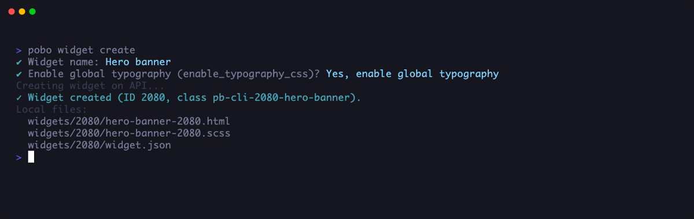
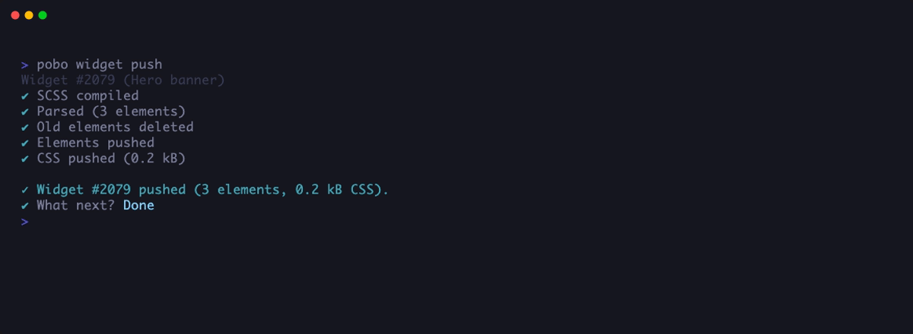
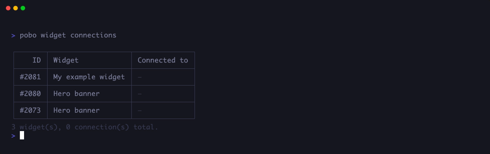
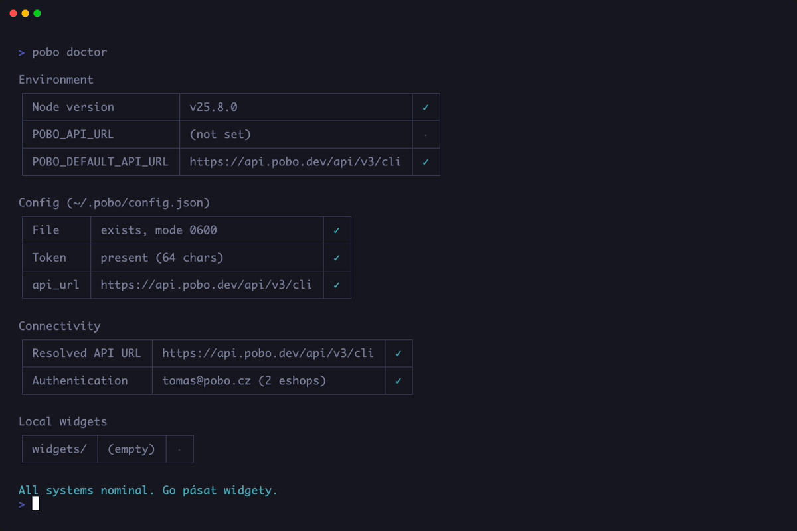

# Pobo CLI

CLI tool for creating widgets for Pobo Page Builder locally in your editor (HTML + SCSS) instead of through the admin UI.

[](./LICENSE)
[](https://nodejs.org/)
[](https://www.npmjs.com/package/@pobo/cli)

> **About this repository:** This is the public **build artifact mirror** of [`@pobo/cli`](https://www.npmjs.com/package/@pobo/cli). Source code lives in a private repository; this mirror exists so anyone can audit the JavaScript that ships to npm. The contents here are produced by the same release pipeline that publishes to npm, and you can verify integrity by comparing `npm pack @pobo/cli@2.0.0` against this repo at tag `v2.0.0`.

---

## Install

```bash
# npm
npm install -g @pobo/cli

# yarn (classic v1)
yarn global add @pobo/cli
```

## Requirements

- **Node.js ≥ 20.12**
- A Pobo account with at least one e-shop

## Quickstart

```bash
# 1) Sign in
pobo auth login

# 2) Create a widget (creates the widget on the server and scaffolds ./widgets/<id>/)
pobo widget create

# 3) Edit HTML/SCSS in your editor
cd widgets/<id>
$EDITOR <slug>-<id>.html
$EDITOR <slug>-<id>.scss

# 4) Validate and push
pobo widget validate
pobo widget push

# 5) Connect the widget to an e-shop
pobo widget connect
```

## What it looks like

### Scaffolding a new widget — `pobo widget create`



Prompts for a widget name and the `enable_typography_css` flag, creates the widget on the server, and scaffolds `widgets/<id>/` in your current working directory with a starter `<slug>-<id>.html`, `<slug>-<id>.scss`, and a `widget.json` metadata file. From there you edit the HTML/SCSS in your editor and `pobo widget push` to ship.

### Pushing HTML + compiled SCSS — `pobo widget push`



Compiles SCSS locally with `sass` (compressed output), parses HTML server-side to verify allowed tags/attributes, flushes the widget's old elements, uploads the new element tree, and pushes the compiled CSS. Each step has its own spinner so you see exactly which stage failed if anything goes wrong. Resolves the widget automatically when run from inside `widgets/<id>/`; otherwise pass `[id]` or use the interactive picker.

### Inspecting widget × e-shop connections — `pobo widget connections`



Prints a matrix of all your widgets and the e-shops each one is connected to. Use it as a quick overview before changes (`connect`, `disconnect`) or when you can't remember whether a widget is live on a given store. The bottom line totals the widgets and connections on your account.

### Health check — `pobo doctor`



Runs four sets of checks — environment (Node version, env vars), config (`~/.pobo/config.json` presence + mode + token), connectivity (resolved API URL + authentication), and local widgets (validity of every `widget.json`). The first thing to run when something behaves weirdly; the hints under each failed/warning row tell you exactly what to fix.

## Interactive shell

Run `pobo` with no arguments to enter an interactive REPL:

```text
pobo
```

You get an ASCII banner, a `pobo>` prompt, and Tab autocomplete for every command. Useful when you don't remember the exact subcommand or want to chain several calls without retyping `pobo` each time. Built-in shortcuts: `help` lists commands, `clear` redraws, `exit` / `quit` / `Ctrl+D` quits.

In non-interactive environments (piped input, CI, scripts), `pobo` without arguments prints the help screen as before — REPL only starts in a real terminal.

## Commands

```text
pobo auth login              Sign in with email and password
pobo auth logout             Sign out
pobo auth me                 Show current user info and available e-shops

pobo widget list             List your widgets
pobo widget create           Create a new widget on the server + local scaffold
pobo widget ai [id]          Generate widget HTML/SCSS from an image via Claude
pobo widget show [id]        Show widget details from the server
pobo widget push [id]        Push HTML + compiled SCSS to the server
pobo widget validate [id]    Validate widget HTML server-side
pobo widget connect [id]     Connect a widget to one or more e-shops (multi-select)
pobo widget disconnect [id]  Disconnect a widget from one or more e-shops (multi-select)
pobo widget connections      Show widget × e-shop connections matrix
pobo widget flush [id]       Delete widget elements (widget itself stays)
pobo widget delete [id]      Delete the widget from the server (cannot be undone)
pobo widget preview [id]     Open the widget preview page in your browser
pobo widget proxy [url]      Live preview the widget on a real e-shop page

pobo doctor                  Health check (env / config / connectivity / local widgets)
pobo init                    Write CLAUDE.md to current directory (for Claude Code context)
pobo help                    Show help
```

Commands marked with `[id]` resolve the widget automatically when you run them from inside `widgets/<id>/`. Without an `id` argument and outside a widget folder, you get an interactive picker.

`-y` / `--yes` skips confirmation prompts on destructive operations (`delete`, `flush`, `disconnect`) — useful in CI scripts.

### Server-side AI generation (`pobo widget ai`)

Have a design image? Let Pobo generate the widget for you:

```bash
pobo widget create                       # creates the widget on the server + local scaffold
pobo widget ai <id> --image design.png   # generates HTML/SCSS from your image
pobo widget validate <id>
pobo widget push <id>
```

PNG, JPG, or WebP, up to 5 MB. No Anthropic API key or Claude Code subscription needed — billing runs through your Pobo account.

### Claude Code integration (zero-setup AI)

If you'd rather iterate on the markup inside your editor — refine the design step by step, mix manual edits with AI rewrites — and you already have [Claude Code](https://docs.claude.com/en/docs/claude-code) installed, use the auto-installed `CLAUDE.md`. After running `pobo auth login`, the CLI drops a `CLAUDE.md` file into your current directory containing Pobo's widget rules, the CLI command cheatsheet, and an example. Then:

```bash
yarn global add @pobo/cli        # one-time install
pobo auth login                  # logs in + writes CLAUDE.md
claude                           # open Claude Code in this directory
# In Claude Code, attach a design image and say:
#   "Create a widget from this design"
# Claude reads CLAUDE.md, runs `pobo widget create`, writes the HTML/SCSS,
# validates, and pushes — all using your existing Pobo login.
```

Billing for the AI runs through your Claude Code subscription — no Anthropic API key needed. Existing `CLAUDE.md` files are never overwritten. To regenerate later (after a CLI update, for example): delete the file and run `pobo init`.

### Preview a widget (`pobo widget preview`)

```bash
pobo widget preview         # interactive picker
pobo widget preview 320     # skip picker
pobo widget preview --no-open
```

Opens the widget's preview page on Pobo (`https://client.pobo.space/cli/widget/preview/<id>` by default) in your browser. Sign in to Pobo in the browser if prompted — the CLI session and the web session are separate. Useful for sharing a quick look at the rendered widget without setting up a live `proxy` against an e-shop page. Override the host via the `POBO_FRONTEND_URL` env var when working against a staging frontend.

### Live preview (`pobo widget proxy`)

```bash
pobo widget proxy https://my-eshop.example.com --selector '.basic-description'
```

Starts a local HTTP server (default port `3001`, auto-falls back to next free port if busy) and **auto-opens the preview URL in your browser**. The widget HTML/CSS is injected into the element matching `--selector`. Saves to local `.html`/`.scss` trigger an SSE-driven auto-update in the browser — no manual reload, no upload to production. Pass `--no-open` to skip the auto-open (handy in headless environments / over SSH).

Run without arguments to start an interactive wizard that asks for the URL and selector.

## Widget folder layout

After `pobo widget create` (or after `pobo widget push` from existing files):

```text
widgets/<id>/
├── widget.json               # metadata: id, name, root_class, file names
├── <slug>-<id>.html
├── <slug>-<id>-core.scss     # production SCSS, compiled to CSS and rendered on real e-shop pages
└── <slug>-<id>-preview.css   # plain CSS (no SCSS, no compile) — shipped verbatim to the admin preview canvas
```

`widget.json` example:

```json
{
  "id": 320,
  "name": "Hero banner",
  "root_class": "pb-cli-320-hero-banner",
  "html": "hero-banner-320.html",
  "scss": "hero-banner-320-core.scss",
  "css_preview": "hero-banner-320-preview.css"
}
```

In day-to-day work you edit `*-core.scss`. Core declares CSS custom properties (`--bg`, `--head-top-size`, …) on the root selector and consumes them via `var(--name)`. The preview file ships starter overrides for the same custom properties — leave it alone unless you specifically want to tweak how the widget looks inside the Pobo admin preview canvas (those rules never reach real e-shop visitors).

## HTML rules (server-side validation)

**Allowed tags:** `div`, `a`, `h1`, `h2`, `h3`, `p`, `ul`, `li`, `span`, `img`, `textarea`, `aside`

**Allowed attributes:**

- universal: `class`
- `<a>`: `class`, `href` (only `http://`, `https://`, `mailto:`, or absolute path `/foo`)
- ``: `class`, `src`, `alt`, `title`, `width`, `height`

**Forbidden:** `<script>`, `<style>`, HTML comments, CDATA, inline event handlers (`onclick=`, `onerror=`, ...), URL schemes `javascript:`, `data:`, `file:`.

**Limits:** 65 535 bytes of HTML, max 500 elements, max 5 000 chars in text, max 2 048 chars in URLs.

## CSS / SCSS rules

SCSS is compiled with `sass` (compressed output). The following constructs are forbidden in the final CSS:

`@import`, `expression(`, `javascript:`, `vbscript:`, `behavior:`, `-moz-binding`.

## Configuration

After `pobo auth login`, the API URL and token are stored in `~/.pobo/config.json` (mode `0600` on POSIX). The CLI ships with the production API URL baked in, so a fresh install works out of the box — no environment setup needed.

The `cli_token` is generated by the server at login and stored only as a SHA-256 hash on the server side. Logging in on another machine invalidates the previous session.

## Troubleshooting

Run `pobo doctor` first — it checks Node version, config file, API reachability, authentication, and local widgets, and tells you what's missing.

| Error                   | Likely cause                                                                 |
|-------------------------|------------------------------------------------------------------------------|
| `Cannot connect to API` | API URL wrong, server not running, or network blocked                        |
| `Not authenticated`     | Run `pobo auth login`                                                        |
| `Invalid CLI token`     | Token rotated (you logged in elsewhere) — sign in again                      |
| `HTML contains errors`  | Server validation rejected your markup — fix per the listed errors and retry |

## Verifying this build

Compare the npm tarball against this repo at the matching tag:

```bash
npm pack @pobo/cli@2.0.0            # downloads pobo-cli-2.0.0.tgz
tar -xzf pobo-cli-2.0.0.tgz         # extracts ./package/
diff -r package/ <this-repo-checkout>     # should be empty
```

The contents of this repository are produced from the same release pipeline that publishes to npm — both should be byte-identical at every tagged version.

## Issues & feature requests

[github.com/pobo-builder/pobo-cli/issues](https://github.com/pobo-builder/pobo-cli/issues)

Pull requests are not accepted in this repository (it is a read-only mirror of build output). Open an issue if you want to discuss a change.

## License

[MIT](./LICENSE) © Pobo Builder s.r.o.
